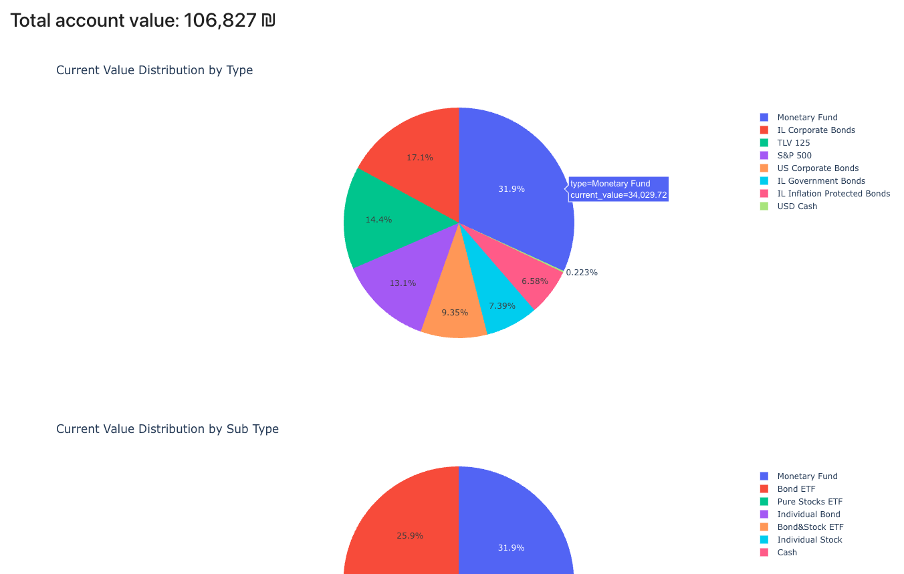

# Spark-Portfolio-Analyzer

## Overview
A tool to get some visualizations over data from "Spark" ordernet trade platform. (since Spark's builtin visualizations sucks)

How it looks:


## Prerequisites
Before running Spark Portfolio Analyzer, ensure that:
- Python 3 and pip is installed on your system.
- Update `instrument_details.yaml` with the relevant details of the instruments you want to analyze.
- Download from Spark the xlsx file from your portfolio page.

## Installation

### Quick Setup (Recommended)
Run the automated setup script to create a virtual environment and install all dependencies:

```bash
./first_time_setup.sh
```

This script will:
- Create a Python virtual environment
- Activate the virtual environment
- Install all required packages from `requirements.txt`
- Provide instructions for future use

### Manual Setup
If you prefer to set up manually:

1. Create and activate a virtual environment:
```bash
python3 -m venv venv
source venv/bin/activate  # On Windows: venv\Scripts\activate
```

2. Install required packages:
```bash
pip install --upgrade pip
pip install -r requirements.txt
```

3. [Optional] Install Mercury for web interface:
```bash
pip install mercury
```

## Usage

### Activating the Environment
Before running the analyzer, make sure to activate the virtual environment:
```bash
source venv/bin/activate  # On Windows: venv\Scripts\activate
```

### Option 1: Running in a Jupyter Notebook
1. Ensure the virtual environment is activated
2. Change in the 3rd cell the `demo_data.xlsx` to the file path of the xlsx from Spark.
3. Run the notebook:
```bash
jupyter notebook spark_portfolio_analysis.ipynb
```

### Option 2: Running in Mercury
1. Ensure the virtual environment is activated
2. Run mercury with the following command:
```bash
mercury run
```
3. Add the notebook to Mercury (this needs to be done only once):
```bash
mercury add spark_portfolio_analysis.ipynb
```
4. Go to the Mercury UI at http://localhost:3000 and navigate to the notebook.
5. Upload the xlsx file to Mercury using the UI, and wait for the results.

## Deactivating the Environment
When you're done working with the project:
```bash
deactivate
```
## Troubleshooting
- If you encounter permission issues with the setup script, make it executable: `chmod +x first_time_setup.sh`
- If Python 3 is not found, ensure it's installed and added to your system PATH
- For Windows users, use `python` instead of `python3` and `Scripts\activate` instead of `bin/activate`